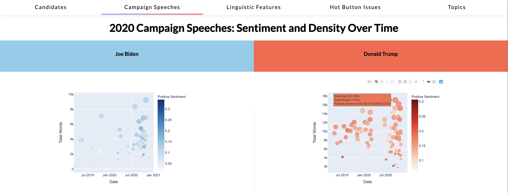

# Political Speech Analysis
An analysis and visualization of political speeches of the 2016 US Presidential Election using **JavaScript** and **D3**. I also used a **Latent Drichlet Association** (LDA) model to extract themes of speeches throughout the campaign per candidate. 

## How To View
The site and plots are intended to be interactive! Feel free to check out the [GitHub pages](https://ncanna.github.io/political-speeches/) for this repo to explore the visualizations. 
